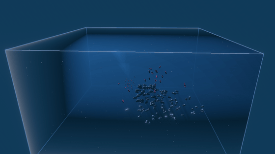

# 🦑 Squid vs Tuna — 3D Boids

A 3D flocking simulation built with the [Bevy](https://bevyengine.org) game
engine, inspired by Jonas Lindstrøm's [Boids](https://github.com/jonas-lj/Boids)
project and reimagined in three dimensions with a predator/prey twist.



> The preview above is rendered by the app itself running **headless** on
> software Vulkan (lavapipe) — see [Rendering a preview](#rendering-a-preview).

Two schools share a tank filled with **moving water**: a swirling current drags
the schools around and stirs them into eddies, drifting "marine snow" particles
sink through the volume, distance fog fades far-off fish into clear blue depth,
and **sunlight scatters down** through the water in slanted shafts — so the tank
reads as a body of clear blue water, not empty space. Below it all lies a sandy
**seabed** with half-sunken rocks and kelp swaying in the current, catching the
schools' soft shadows as they pass overhead.

Two schools share that tank:

- **🦑 Squid (prey)** — flock tightly using classic Reynolds rules and **ball up**
  into a tight bait ball, then **flee** as one unit when tuna close in. They are
  nimble and pivot sharply to dodge.
- **🐟 Tuna (predators)** — bigger and faster, they **hunt as a pack**: the whole
  group locks onto the centre of a squid school and **charges** it with a speed
  burst. Their wide turning radius means a charge overshoots and sweeps around
  for another pass. When a tuna catches a squid, the squid is eaten and respawns
  elsewhere, so the populations stay constant and the chase never ends.

## The boids model

Every fish steers using three local rules over its same-species neighbours,
plus an inter-species interaction and a soft tank boundary:

| Rule | Description |
| --- | --- |
| **Separation** | Steer away from crowding neighbours (inverse-square weighted). |
| **Alignment** | Match the average heading of nearby neighbours. |
| **Cohesion** | Steer toward the average position of nearby neighbours. |
| **Flee / Hunt** | Squid steer away from nearby tuna; tuna steer toward the closest squid. |
| **Boundary** | A restoring force keeps each fish inside the tank. |
| **Current** | The surrounding water pushes each fish along the local flow, so the whole school drifts and curls with the eddies. |

All tuning lives in [`src/config.rs`](src/config.rs) (`SimConfig`): tank size,
school sizes, per-species speeds and forces, perception radii, the
flee/hunt/eat distances, and the water (`WaterParams`: current strength/scale,
bulk drift, and the drifting particles). Tweak and re-run to change the dynamics.

## The fish

Each creature is more than a single blob: it's a small **procedural rig** of
parts assembled from Bevy primitives in [`src/setup.rs`](src/setup.rs), with the
orientation baked into every fin's mesh so the entity carrying it can pivot
cleanly at the joint.

- **🐟 Tuna** — a smooth fusiform body with a pale countershaded belly, a tall
  forked **caudal fin**, two dorsal fins, an anal fin, rows of the bluefin's
  signature **yellow finlets**, and two **pectoral fins**. The body and tail
  hang off a `Body` pivot near the head, so motion travels down the flank to
  the tail.
- **🦑 Squid** — a tapered, pointed **mantle**, two posterior **lateral fins**, a
  head, and a trailing sheaf of **arms/tentacles**.

Both species have two-part eyes (a pale eyeball with a dark pupil), and every
fish rolls its own **skin tone and body size** at spawn, so each school reads
as a crowd of individuals rather than stamped copies.

The parts a fish can flex are tagged with `FishPart` (the "skeleton"), and
[`src/animation.rs`](src/animation.rs) drives them every frame:

| Part | Motion |
| --- | --- |
| **Tuna body** | A gentle carangiform S-curve the tail rides on. |
| **Caudal fin** | Yaws side to side — the main thrust, lagging the body wave. |
| **Pectoral fins** | Paddle slowly, mirrored side to side. |
| **Squid mantle** | Pulses in and out, evoking jet propulsion. |
| **Lateral fins** | Roll in a travelling ripple, the two sides half a cycle apart. |
| **Tentacles** | Sway and nod, trailing as the squid swims. |

The beat **frequency rises with swimming speed** and each fish carries a random
phase/tempo (`SwimGait`), so a charging tuna thrashes its tail hard and fast
while a cruising one barely idles — and no two fish in a school are ever quite
in step.

## The water body

The water is a lightweight, dependency-free effect built on what Bevy
already ships, so it also runs under the headless software renderer:

- **Current** — an analytic velocity field (a slow bulk drift plus a few
  out-of-phase, slowly animating sinusoidal swirls) sampled per fish in
  [`src/water.rs`](src/water.rs). It's added to each boid as an external force,
  so it's still bounded by the species' speed envelope and turning radius.
- **Marine snow** — a few hundred faint particles that the current advects and
  that slowly sink, wrapping back in from the top so the volume stays populated.
- **Clear water** — a faint translucent blue box, exactly the size of the
  wireframe tank, gives the water a clear, see-through body that fills the tank
  right to its edges.
- **Distance fog** — an exponential `DistanceFog` on the camera tints and fades
  distant fish into the water colour.
- **Sunlight** — a `VolumetricLight` "sun", tilted slightly off vertical so every
  fish has a lit flank and a shaded flank, scatters through a `FogVolume` filling
  the tank: light glows softly down through the water in slanted shafts and the
  schools cast soft shadows onto the seabed. The cameras render in HDR with
  bloom so the lit water and fish glow.
- **Seabed** — a sandy floor just below the tank, scattered with half-sunken
  rocks and clusters of **kelp blades that sway in the current**, grounds the
  scene and fades into the fog with distance.

## Running

Requires a recent Rust toolchain.

```bash
cargo run --release
```

On Linux you'll need the usual Bevy build dependencies (ALSA + udev), e.g. on
Debian/Ubuntu:

```bash
sudo apt-get install -y libasound2-dev libudev-dev libwayland-dev libxkbcommon-dev pkg-config
```

## Controls

| Key | Action |
| --- | --- |
| `W` `A` `S` `D` / Arrow keys | Orbit the camera |
| `Q` / `E` | Zoom in / out |
| `Space` | Toggle automatic orbiting |

## Project layout

| File | Responsibility |
| --- | --- |
| `src/main.rs` | The game binary: windowed app, plugins, and system schedule. |
| `src/lib.rs` | Shared library re-exporting the simulation modules. |
| `src/bin/capture.rs` | Headless renderer that saves a PNG sequence (no window). |
| `src/components.rs` | ECS components (`Species`, `Velocity`, the `FishPart` rig, markers). |
| `src/config.rs` | `SimConfig` tuning resource and the `Score` tally. |
| `src/setup.rs` | Spawns the lights, tank, and both schools (incl. the fish rigs). |
| `src/flocking.rs` | The boids rules, movement, and the hunting/eating logic. |
| `src/animation.rs` | Procedural swim animation that flexes each fish's `FishPart` rig. |
| `src/water.rs` | The water current field plus the drifting "marine snow" particles. |
| `src/camera.rs` | Orbit camera state and input. |
| `src/ui.rs` | Heads-up display and the wireframe tank boundary. |

## Rendering a preview

The `capture` binary runs the simulation with **no window**, rendering each
frame to an offscreen image and saving it as a PNG. This works even without a
GPU by using a software Vulkan driver such as Mesa's lavapipe:

```bash
# One-time: software Vulkan + an encoder (Debian/Ubuntu)
sudo apt-get install -y mesa-vulkan-drivers ffmpeg

# Render a PNG sequence to $CAPTURE_DIR. The capture camera holds still (so the
# swimming is the motion); CAPTURE_RADIUS / CAPTURE_PITCH frame the shot.
VK_ICD_FILENAMES=/usr/share/vulkan/icd.d/lvp_icd.json WGPU_BACKEND=vulkan \
CAPTURE_DIR=/tmp/squidcap CAPTURE_WARMUP=50 CAPTURE_FRAMES=150 \
CAPTURE_RADIUS=60 CAPTURE_PITCH=0.22 \
cargo run --release --bin capture

# Encode the frames into a GIF (dither=none keeps the file small on the smooth
# water gradient; drop it for finer shading at a larger size).
ffmpeg -y -framerate 24 -i /tmp/squidcap/frame_%04d.png \
  -vf "fps=18,scale=560:-1:flags=lanczos,split[s0][s1];[s0]palettegen=stats_mode=diff[p];[s1][p]paletteuse=dither=none" \
  assets/preview.gif
```

`CAPTURE_WARMUP` skips initial frames so the schools settle before capture,
`CAPTURE_FRAMES` sets how many frames to save, and `CAPTURE_RADIUS` /
`CAPTURE_PITCH` frame the shot (the preview above used the values shown). Set
`CAPTURE_AUTO_ORBIT=1` to slowly orbit the camera like the windowed game.

## License

MIT.
